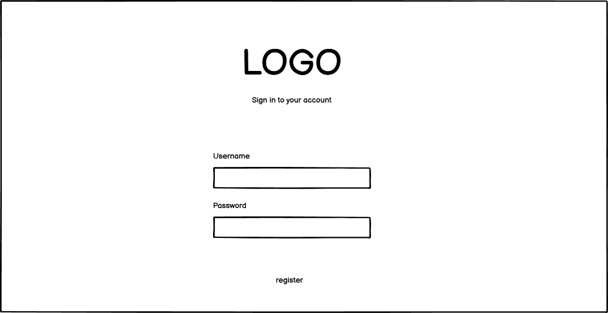
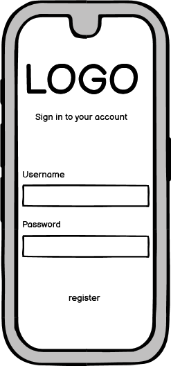
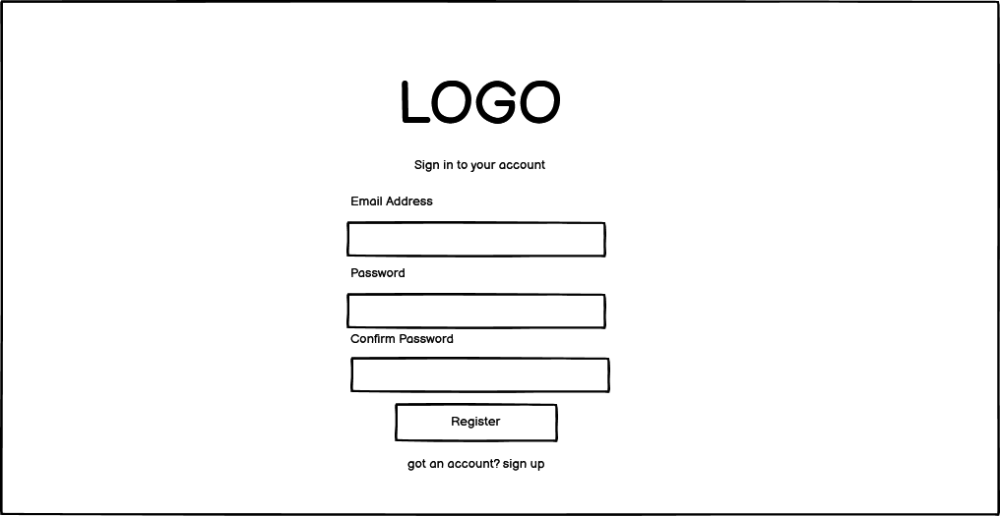
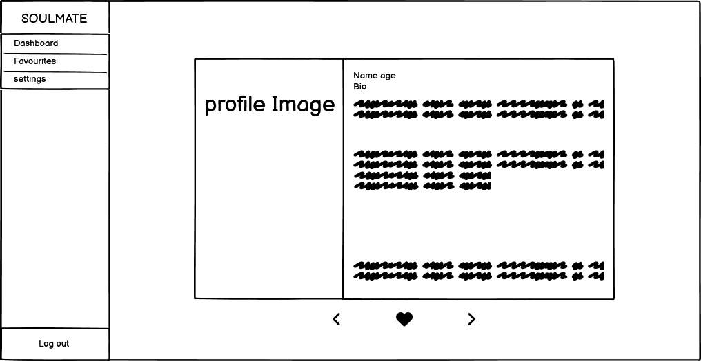
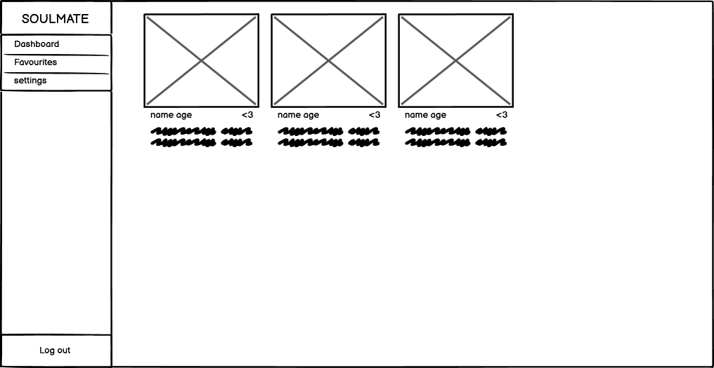
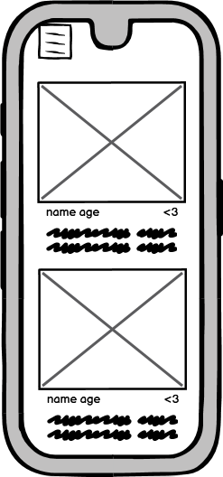
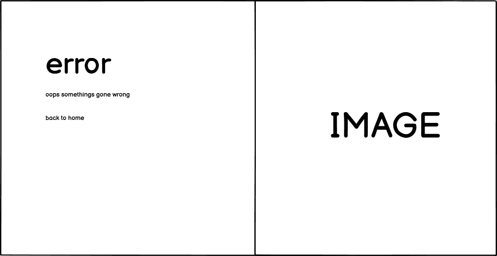
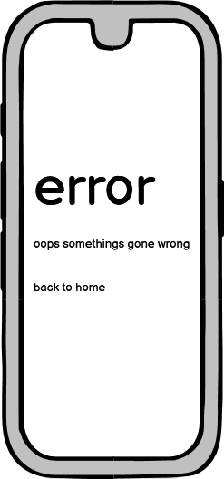
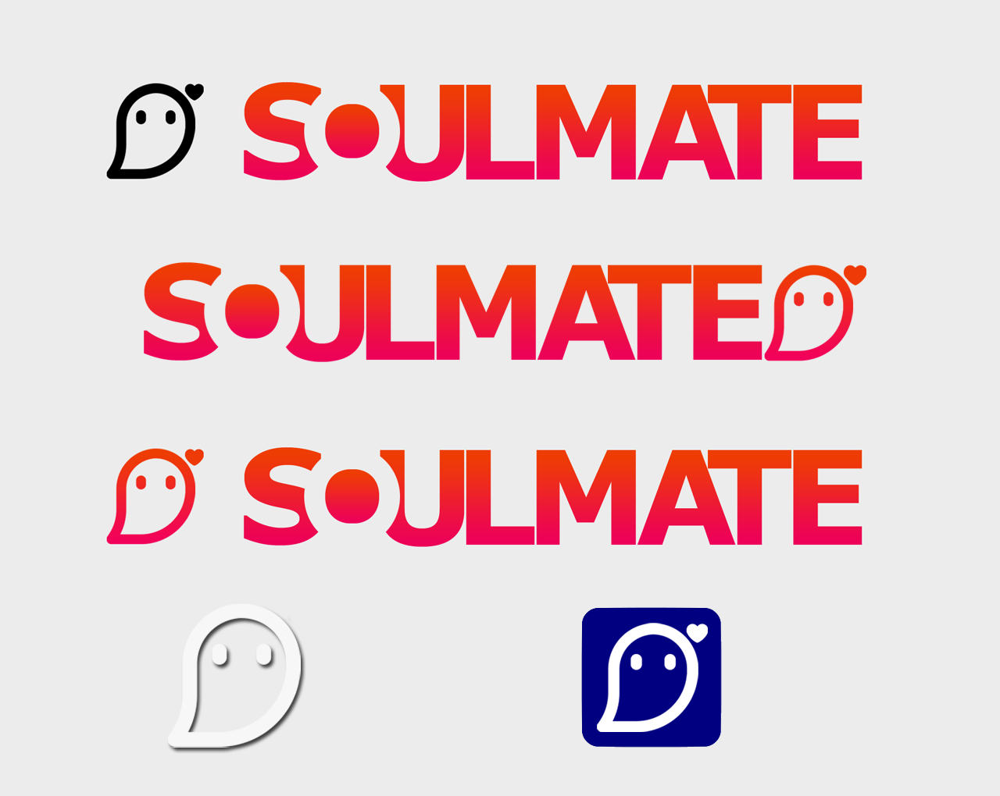
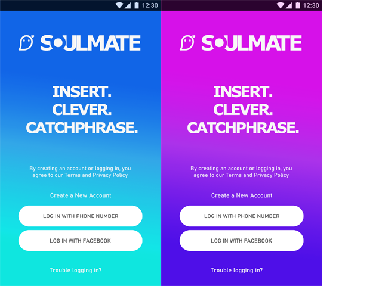

# Soulmate dating app

## Code institute milestone project three

Welcome to Soul Mate - the premier dating app designed to help you find meaningful connections and lasting love. Whether you're looking for a serious relationship, a fun date, or simply a new friend, Soul Mate is here to make the process enjoyable and successful.

## [View Soulmate in xxxxx]()

Features

1. Profile Creation
   Create a profile that reflects your personality and interests.

2. Profile Editing
   Add a photo, Change your bio name and age in the settings reflected in your profile.

3. Dashboard 
   Find other users signed up on the soul mate data base 

4. Favourites
   Add profiles from the dashboard to your favourites and find their full profiles instantly 

## User Experience (UX)

### User Stories

### As a new customer:

-   be able to create a new account as simply as possible taking a username and password
-   after signing up capture additional information such as hobbies and bio, tags for personal preferences
-   to be able to upload pictures to my profile
-   want to be able to add users to my favourites for future browsing

### As the business owner:

-   I would like to present a modern and attractive looking dating app
-   I would like the app to be desgined cleanly with a professional look
-   I would like navigation to be easy
-   I would like the sign up process to be easy 
-   I would like for users to be able to move through the database of other users
-   I would like for users to be able to favourite other accounts 
-   I would like for users to be able to update their details easily

### Strategy

Cretate a functional and high end dating app with all the features people have come to expect while improving on the concept.

## Structure of the website

Soulmate comprises of a login screen and a Registration page that leads to a dashboards containing multiple features such as a settings page that allows the user to alter their personal details as well as a favourites page that contains the liked individuals from the datatbase.

## Wireframes

I used the balsamiq programme to create the initial wireframes.

### Login Wireframes

### Registration Wireframes

### Dashboard Wireframes

### Favourites Wireframes

### Error Wireframes

### Colors

Main colours used in the project:

Text in paragraphs :

### Images

-   Logos imagery and concepts for soul mate were created by myself using video and photo editing software such as adobe photoshop and capcut.

## logo design concepts

## login concept

# Features
The website consists of a single page with a title, gamecontainer and buttons for the sound and the game mode.

The website has the below features:

## Login

* #### The login screen is comprised of an input for email and password with a link that take users to a page allowing them to sign up and create an account

## Registraion

* #### The registration page is where users will create an account

    * The page consists of a username field and password field
    * An addition field is available for the user to confirm their password

       

## Dashboard

* The dashboard is the page a user will land on after signing in and comprises of the data for other users being show
* The user is able to forward their search randomly through other members of the dating app
* A favourite button is included to add a user to a favourites page for future browsing

## Favourites page

* The users favourited accounts will be kept in this page
* The user can remove accounts from this page by clicking on the unfavourite button

## Settings page

* The user has access to multiple options allowing them to change their display picture, name and or bio
* The user is also able to delete their account and remove themselves from the database here

## Error page

* If the user encounters an error for any reason they will be redirected to this error page that then grants them the option to return to the dashboard

##  Future implementations

* Filters to specificy unique aspects of other users they which to find
* A messaging service for users to communicate

# Technologies used

### HTML5
* As a structure language.

### CSS
* As a style language.

### Javascript
* As a style language.

### Tailwind CSS 
* Tailwind 3.2 as a CSS framework to keep responsive, mobile first aproach.

### GitHub
* As a software hosting platform to keep project in a remote location.

### Heroku
* As a platform for hosting the app

### Mongo DB
*

### Git
* As a version-control system tracking.

### Gitpod
* As a development hosting platform.

### Balsamiq
* As a wireframing tool.

### Photoshop CS2
* As an image editor.

# Testing

## Functionality testing 

 I used Chrome developer tools throughout the project for testing and solving problems with responsiveness and style issues.

## Media Query / Resolution testing 

### Desktop Resolution

 

 ### Tablet Resolution

 

 ### Mobile Resolution

 

## Compatibility testing
 Site was tested across multiple virtual mobile devices and browsers. I checked all supported devices in Chrome developer tools. 
 
 I tested on hardware devices such as: Dell Latitude with Windows OS's, Huawei P30 smartphone with Android OS on google chrome browser and samsung A7 lite with Android OS.

## User stories testing

### As the Site Owner:

- 

-   I would like to present a modern and attractive looking dating app
      >Site loads into a modern login page powered by tailwind css
-   I would like the app to be desgined cleanly with a professional look
      >Site adheres to mordern design conventions and is responsive
-   I would like navigation to be easy
      >navigation layout is straight forward and simple to understand with the side bar and mobile burger
-   I would like the sign up process to be easy 
      >Sign up is fast an easy allowing the user to move straight to the dashboard upon creation of account
-   I would like for users to be able to move through the database of other users
      >User is capable of browsing randomly selected account on the dashboard
-   I would like for users to be able to favourite other accounts 
      >User has access to a favourite button that will move an account into their personal favourites page
-   I would like for users to be able to update their details easily
      >User has access to a variety of details they are able to change in the settings menu including, display picture, bio and name

### As a new customer:

### As a new customer:

-   be able to create a new account as simply as possible taking a username and password
      >Navigation to the registration page is easy and straight forward from the login page
-   after signing up capture additional information such as hobbies and bio, tags for personal preferences
      >User is able to upload a picture and enter their name for other account holder to see when browing the app
-   to be able to upload pictures to my profile
      >The user is able to upload and save a profile picture from the settings page
-   want to be able to add users to my favourites for future browsing
      >A favourites button is available under all other accounts allowing the user to move it into a personal favourites

## Issues found during site development

I had issues when trying to intergrate audio into the game as chrome mutes any sound on page launch, I rectified this by adding the option to enable sound through the modal ensuring that the user was both agreeing to have sound on the page and interacting with the page before hand.
#

when employing the harder difficulty mode I ran into problems with the code understanding that the game cards that were invisble were not to be interacted with leading to a situation where the smaller easier gameboard would not reset on completion, through use of debugging in dev tools i found this to be an issue with the javascript conflicting with the elements css's display styling at default.

#

game tiles appeared to be blown out of proportion on actual device but was rectified by updating old built in browsers and using more modern borwsers like chrome & fire fox to be able to understand more moder css stylings like scale etc.

#
using transform scale styling created a transitional problem where the back facing images would not scale the same as the front, I fixed this my changing the transform scale style to the more modern scale styling

## Manual testing

I performed various exercises on the game inputting on the gamecards and button in an attempt to break the game or page

## Automated testing

## Code Validation
 At the and of the project I used two websites to validate a code
 
 * [W3C CSS Validator]() to validate CSS
  
  #

   * [Wave](https://wave.webaim.org/report#/https://trollope91.github.io/Milestone-Project-2/) to assess page accessibility and error check
  

  #
 * [Nu Html Checker](https://validator.w3.org/) to test HTML
  
  #
*  [jshint](https://jshint.com/) To error check javascript code

# Deployment

The project was deployed on GitHub Pages. I used Gitpod as a development environment where I committed all changes to git version control system.

## Repository

https://github.com/Trollope91/Milestone-Project-2

## Live link

https://trollope91.github.io/Milestone-Project-2/

## Copying the repository

A user can make a local copy of my repository by going to the GitHub repository page of my project and clicking on the "Code" button which will open a dropdown menu, select the protocol (HTTPS or SSH) for the clone URL and copy it to the clipboard.
Open a terminal on their local machine and navigate to the directory where they want to store the project then type the command "git clone" followed by the URL they copied in step 3, and press Enter.
Wait for the cloning process to complete.

## Clone link

https://github.com/Trollope91/Milestone-Project-2.git

## Forking the repository

To fork the repository the user can go to the GitHub repository page of the project and click on the "Fork" button in the upper right-hand corner of the page, select the account they want to fork the project to and then wait for GitHub to create a copy of the project in their account.
Once the fork is complete the project will be available under their account with the option to clone to their local machine.

___
# Credits

* To complete this project I used Code Institute student template: [gitpod full template](https://github.com/Code-Institute-Org/gitpod-full-template)

* Ideas and knowledge library:

    * [bootstrap modal alignment](https://aguidehub.com/blog/how-to-show-bootstrap-modal-popup-in-center-of-screen/)

    * [monkey testing](https://css-tricks.com/intro-monkey-testing-gremlins-js/)

    * [udacity](https://www.udacity.com/blog/2021/03/creating-an-html-404-error-web-page.html)

    * [w3schools.com](https://www.w3schools.com)

    * [css-tricks.com](https://css-tricks.com/)

    * [getbootstrap.com/docs](https://getbootstrap.com/docs/4.6.2/getting-started/introduction/)

    * [Card flipping tutorial](https://marina-ferreira.github.io/tutorials/js/memory-game/)

